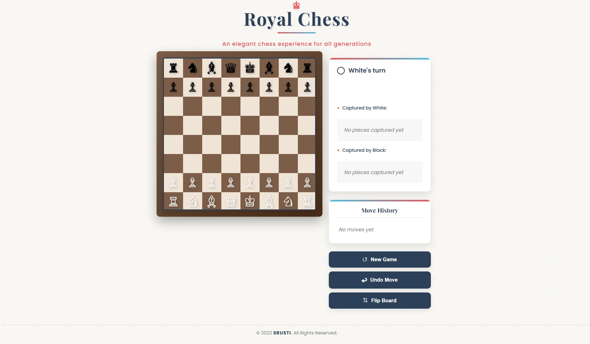

# Chess Game (with Python & Flask)

A simple Chess game built using **Python**, **Flask**, and **JavaScript UI**.  
The project includes a backend chess engine in Python and a frontend user interface for playing chess in the browser.

---

## Project Structure

```

CHESS/
│── **pycache**/           # Compiled Python files
│    ├── board.cpython-311.pyc
│    ├── board.cpython-312.pyc
│
│── Screenshots/           # Project screenshots
│    ├── chess.jpeg
│
│── static/                # Static files (JavaScript, CSS, images)
│    ├── chess\_ui.js
│
│── templates/             # HTML templates (Flask Jinja2)
│    ├── index.html
│
│── app.py                 # Main Flask application entry point
│── board.py               # Chess board logic
│── init.py                # Package initializer
│── LICENSE                # License file
│── README.md              # Project documentation

```

---

## Installation & Setup

1. Clone the repository:
   ```bash
   git clone https://github.com/your-username/chess-game.git
   cd chess-game
```

2. Create a virtual environment:

   ```bash
   python -m venv venv
   source venv/bin/activate   # For Linux/Mac
   venv\Scripts\activate      # For Windows
   ```

3. Install dependencies:

   ```bash
   pip install flask
   ```

4. Run the application:

   ```bash
   python app.py
   ```

5. Open your browser and visit:

   ```
   http://127.0.0.1:5000/
   ```

---

## Features

* Play Chess in the browser
* Python backend with **Flask**
* JavaScript-based chessboard UI
* Handles basic chess moves and game logic

---

## Screenshots

### Game UI



---

## License

This project is licensed under the terms described in the [LICENSE](LICENSE) file.

---

## Author

**Srusti**